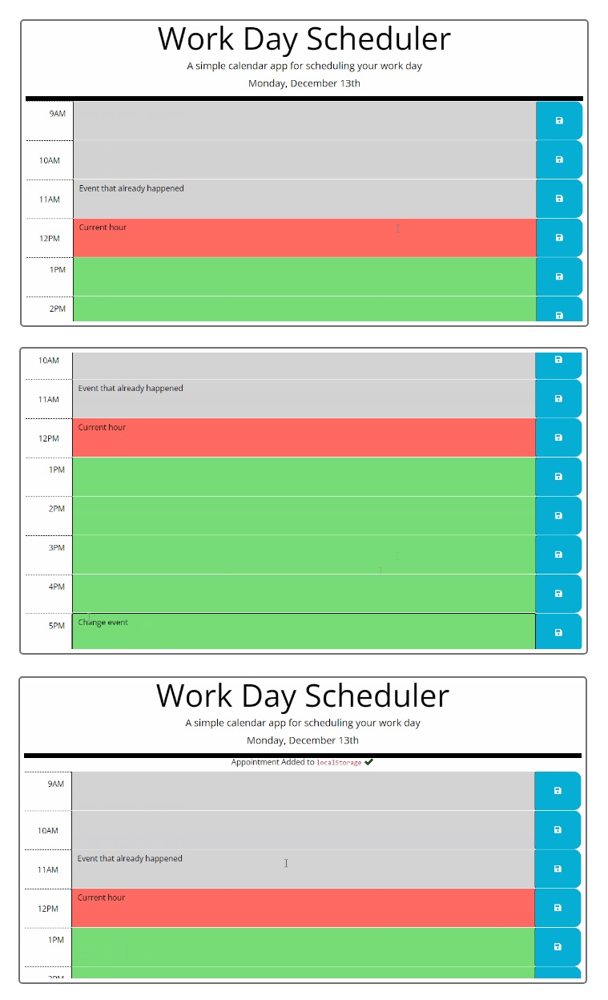

# Bootcamp Module 5 Challenge Assignment -- a Work Day Hourly Schedule Application

## Description

This current Module Challenge assignment -- a Work Day Hourly Scheduler application -- provided a good mechanism for learning introductory JavaScript programming...but with usage and implementation that is more-advanced or more-complex/creative. A large portion and effort of my personal assignment effort was for a significant attempt to consider about and address concerns of data consistency and data parallelization among various related data elements and webpage/interface/functional items. Also...in that task there were many related concerns and implementations...and learnings...for/about event handling and event controls to make sure that the related elements functioned with each other in the desired way. The data save/load required feature of the application also provided good re-practice with the Local Storage functions of the JavaScript system. Aspects of attribute inheritance/bubbling and of DOM traversal were also involved.

The assignment also involved and emphasized--and required--the foundational structure of presentational/GUI elements and background/process elements that were provided through 3rd-party API services (such as jQuery and Bootstrap and Day.js). Because of the Bootstrap involvement...the assignment was a good mechanism for examining and analyzing and understanding (and almost reverse-engineering) the external-file Cascading Style Sheets (CSS) effects of the main imported design and then adding to that design or/and altering/customizing it in various situation-specific ways. The assignment did not involve many concerns about application responsiveness because the 3rd-party foundational systems already included those elements. Because there was some extra coding/schedule time that was surprisingly available during this assignment week...I had some time to consider about and also implement some added enhancement features (which of course became more-complex than what initially was predicted/expected).

----

The objectives -- user story and acceptance criteria items -- of the assignment were as follows:

[ User Story ]

AS AN employee with a busy schedule...I WANT to add important events to a daily planner...SO THAT I can manage my time effectively.

[ Acceptance Criteria ]

GIVEN I am using a daily planner to create a schedule:

-> WHEN I open the planner...THEN the current day is displayed at the top of the calendar.

-> WHEN I scroll down...THEN I am presented with timeblocks for standard business hours.

-> WHEN I view the timeblocks for that day...THEN each timeblock is color coded to indicate whether it is in the past, present, or future.

-> WHEN I click into a timeblock...THEN I can enter an event.

-> WHEN I click the save button for that timeblock...THEN the text for that event is saved in local storage.

-> WHEN I refresh the page...THEN the saved events persist.

[ Additional Grading Criteria ]

Also good coding practices and good GitHub/Git repository configuration.

## Installation

Make sure that you have a GitHub membership and account to be able to view the repository of the assignment webpage system. The published GitHub Pages view of the website should be accessible on the public internet access URL without a need to have a GitHub membership/account.

## Usage

To use this password generator webpage...

1. Click the buttons at before and after the editing of hour information and view the displayed information.
2. Add new information and save it.
3. Close the application and then re-open it...to view the importing of previously-saved information.
4. Modify or/and Delete loaded saved information.
5. Close the application and then re-open it...to view the importing of the previously-saved modified information.
6. Attempt interrupted/staggered modify-and-save actions that use multiple fields and buttons.
7. Leave the application open for more than 1 hour to see the dynamic automatic updating and refreshing of row status color display that is based on the current time.

The following picture shows the appearance of the webpage application:

The following URL is for the GitHub Pages published public view of Todd Kridel's Coding Bootcamp Module Challenge assignment webpage: "https://todd-kridel.github.io/TK-Work-Day-Scheduler".

## Credits

The starter code of this assignment was provided by the Bootcamp-associated GitHub site "https://github.com/coding-boot-camp/crispy-octo-meme" that has the following 3 Contributor members: @Georgeyoo (Georgeyoo George); @mfyke (matt fyke); @cmathena2u (Courtney Mathena).

## License

MIT License

Copyright (c) 2022 DU Full-Stack Web Development Coding Boot Camp

Permission is hereby granted, free of charge, to any person obtaining a copy
of this software and associated documentation files (the "Software"), to deal
in the Software without restriction, including without limitation the rights
to use, copy, modify, merge, publish, distribute, sublicense, and/or sell
copies of the Software, and to permit persons to whom the Software is
furnished to do so, subject to the following conditions:

The above copyright notice and this permission notice shall be included in all
copies or substantial portions of the Software.

THE SOFTWARE IS PROVIDED "AS IS", WITHOUT WARRANTY OF ANY KIND, EXPRESS OR
IMPLIED, INCLUDING BUT NOT LIMITED TO THE WARRANTIES OF MERCHANTABILITY,
FITNESS FOR A PARTICULAR PURPOSE AND NONINFRINGEMENT. IN NO EVENT SHALL THE
AUTHORS OR COPYRIGHT HOLDERS BE LIABLE FOR ANY CLAIM, DAMAGES OR OTHER
LIABILITY, WHETHER IN AN ACTION OF CONTRACT, TORT OR OTHERWISE, ARISING FROM,
OUT OF OR IN CONNECTION WITH THE SOFTWARE OR THE USE OR OTHER DEALINGS IN THE
SOFTWARE.

